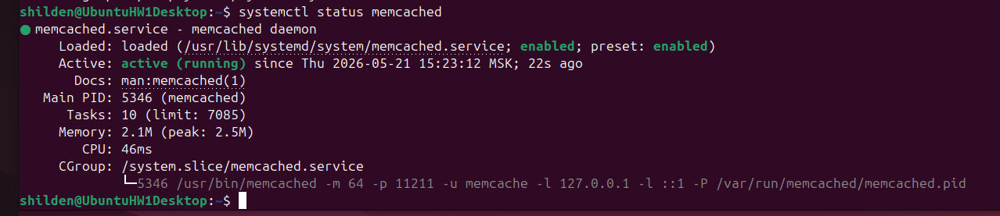
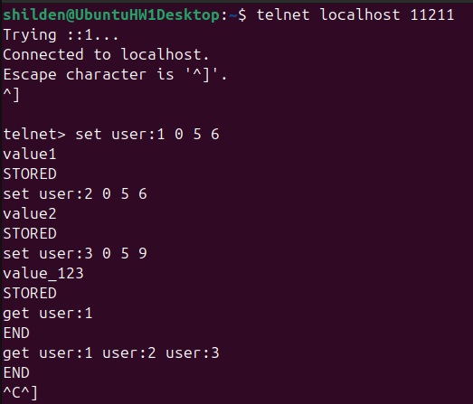
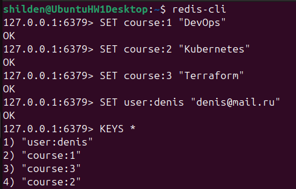
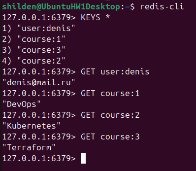

---
## Домашнее задание к занятию «Кеширование Redis/memcached»
---

---
### Задание 1. Кеширование
Приведите примеры проблем, которые может решить кеширование.

Приведите ответ в свободной форме.

---
### Задание 2. Memcached
Установите и запустите memcached.

Приведите скриншот systemctl status memcached, где будет видно, что memcached запущен.

---
### Задание 3. Удаление по TTL в Memcached
Запишите в memcached несколько ключей с любыми именами и значениями, для которых выставлен TTL 5.

Приведите скриншот, на котором видно, что спустя 5 секунд ключи удалились из базы.

---
### Задание 4. Запись данных в Redis
Запишите в Redis несколько ключей с любыми именами и значениями.

Через redis-cli достаньте все записанные ключи и значения из базы, приведите скриншот этой операции.

---

<h2 align="center">Решение</h2>

---

### Задание 1. Кеширование: примеры решаемых проблем
Кеширование решает следующие типовые проблемы:

- Снижение нагрузки на базу данных – часто запрашиваемые данные (например, список топ-100 товаров) хранятся в кеше, благодаря чему СУБД не обрабатывает тысячи одинаковых запросов.
- Ускорение ответа API – вместо тяжёлых вычислений или обращения к внешним сервисам данные отдаются из оперативной памяти (миллисекунды вместо сотен миллисекунд или секунд).
- Сглаживание «эффекта слонов» (thundering herd) – при внезапном всплеске трафика кеш поглощает основную часть запросов, не давая упасть бэкенду.
- Снижение затрат на внешние вызовы – например, результаты платных API (погода, курсы валют) кешируются, чтобы не платить за каждый повторный запрос.
- Обеспечение работы при отказе upstream-сервисов – stale-кеш (устаревшие данные) может временно выдаваться, пока основной источник недоступен.

---

### Задание 2. Memcached

---

### Задание 3. Удаление по TTL в Memcached

Результат проверки TTL в Memcached
*На скриншоте видно, что через 5+ секунд после записи команда get не возвращает значений, возвращая только END — это подтверждает автоматическое удаление ключей по истечении времени жизни.*

---

### Задание 4. Запись данных в Redis

---
